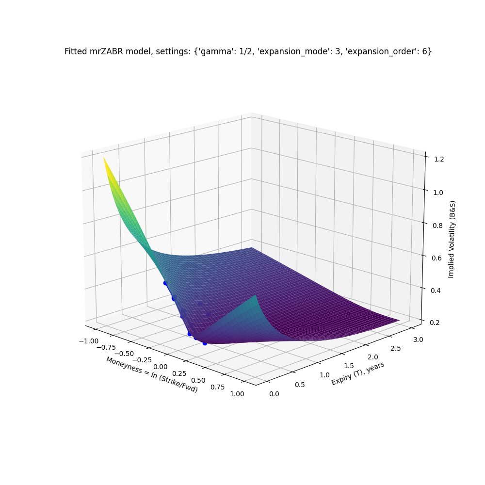

# Closed-form solutions and fast calibration & simulation for SABR-based models with mean-reverting stochastic volatility

## WHY USE IT?

The seminal SABR model (2002) offered a fast closed-form solution for stochastic-volatility models.  
However, the assumption of unbounded volatility diffusion renders the model unrealistic for many markets, particularly equities.

Several recently developed SABR-based models, which extend the standard SABR model to include mean-reverting stochastic volatility, address this shortcoming.

Previous research on such extensions has provided only semi-analytical solutions in the form of deeply nested integrals, except for a few restrictive special cases.
Numerical evaluation of these integrals makes implementations slow and technically challenging in many settings.

This repository derives, applies, and visualizes fast closed-form solutions (in elementary functions) for the mean-reverting SABR extensions.

Thanks to their evaluation speed and robustness, the closed-form solutions become suitable e.g. for **Monte Carlo simulations** of entire implied-volatility surfaces, such as in market-risk VaR scenarios.  The 3D-surface  below is an example output of a model variant:  
  

For transparency and performance, this repository is implemented in Python. However, the resulting closed-form solutions are simple enough to be translated into Excel formulas, enabling model fitting (via Solver) and option pricing even in basic Excel environments without VBA.

## PAPERS

The code of this repository is based on the following paper:
> Perederiy, V., Mean-Reverting SABR Models: Closed-form Surfaces and Calibration for Equities, 2024

which is referenced in the code as ***this PAPER*** and is accessible at:  
https://papers.ssrn.com/sol3/papers.cfm?abstract_id=5171071

Other relevant papers (previous research), as referenced in the code, are:
> ***hSABR PAPER***:     Hagan, P. S., Lesniewski, A., Woodward D. 2018. Implied volatility formulas for Heston models. Wilmott Magazine, November 2018, 44–57

> ***mrSABR PAPER***:    Hagan, P. S., Lesniewski, A., Woodward D. 2020. Implied volatilities for mean reverting SABR models. Wilmott Magazine, July 2020, 62–77

> ***mrZABR PAPER***:    Felpel, M., Kienitz J., McWalter T. A. 2021. Effective stochastic volatility: Applications to ZABR-type models. Quantitative Finance, 21(5), 837–852

## TECHNICAL DETAILS

The mean-reverting stochastic-volatility models generally have 5 parameters:
- *α*: instantaneous volatility
- *θ*: long-term / equilibrium volatility
- *ν*: volatility of volatility
- *λ*: speed of mean reversion
- *ρ*: correlation

This extends the standard SABR model, which has only 3 parameters (*α*, *ν*, *ρ*), by capturing the mean reversion in the additional parameters (*θ* and *λ*).  
This repository deals with the following three mean-reverting variants (and their SABR-based approximations), each defined by a different stochastic process for the volatility *σ*:

1)  Heston model approximation (*hSABR*) with CIR process of the stochastic variance, as in the *hSABR PAPER*:  
*dσ² = λ (θ² - σ²) dt + σ dW*

2)  Mean-reverting SABR (*mrSABR*) with lognormal mean-reverting process of the stochastic volatility, as in the *mrSABR PAPER*:  
*dσ = λ (θ - σ) dt + σ dW*

3)  Mean-reverting ZABR model (*mrZABR*), which generalizes *mrSABR* to mean-reverting CEV processes of the stochastic volatility, as in the *mrZABR PAPER*:  
*dσ = λ (θ - σ) dt + σ γ dW*

To arrive at the closed-form solutions, we build on the semi-analytical solutions from the previous research and apply *SymPy* symbolic integration, together with additional approximations for *mrZABR* (using suitable convergent series expansions).  

The resulting closed-form expressions are the so-called **effective coefficients**. These can then be easily translated into 3 **standardized-SABR parameters** (*αstd*, *νstd* and *ρstd*) of an approximating standard-SABR model.  
Note that the standardized parameters (*αstd*, *νstd* and *ρstd*) depend not only on the original parameters (*α*, *θ*, *λ*, *ν*, *ρ*), but also on the option expiry.  
The standard SABR formula (2002) can then be applied on the **standardized-SABR parameters** to infer the implied volatilities of options for desired expiry / moneyness levels. 

Due to the solutions remaining closed-form, they are **very fast** in Python:  
After the *SymPy* effective coefficients are lambdified into Python functions (which is needed only once),  
the computation time is only about **0.1-1 millisecond per smile slice** of the surface (i.e. for each standard-SABR parameter set *αstd*, *νstd* and *ρstd* as needed for each option expiry).

This is about **100-1000 times faster than numerical integration** of the semi-analytical solutions. The main advantage stems from triple-nested integrals present in the semi-analytical solutions, which are computationally intensive to evaluate numerically.

With this speed advantage, calibrating the 5 parameters to empirical volatility quotes — even with several hundred gradient-descent evaluations — takes under 100 milliseconds, even for more complex model variants.  
Given the parameters, producing a smooth implied-volatility surface on a 100 × 100 moneyness-expiry grid takes less than 50 milliseconds.

## PYTHON CODE

#### [***`derive_validate_expressions.py`***](derive_validate_expressions.py) 
Derives the closed-form solutions in the form of the **effective coefficients** as *SymPy* symbolic expressions and saves them in *pickle* [files](#output-files-results).   
For one code execution, the *hSABR*, *mrSABR* and *mrZABR* coefficients are generated 
(the latter for the particular *mrZABR* configuration set at the beginning of the code).  
The code also rigorously verifies the closed-form results by comparing them to numerical integrations (in the general case *α ≠ θ*), and by comparing to the closed-form expressions derived in the previous research for a simple special case (*α=θ*).

#### [***`fit_display_surface.py`***](fit_display_surface.py)
For a chosen model variant, loads the result expressions (**effective coefficients**) as generated/saved by [`derive_validate_expressions.py`](#derive_validate_expressionspy) from *pickle* [files](#output-files-results).  
The code then translates these into the **standardized-SABR parameters**, and applies the standard-SABR model to infer the implied lognormal (Black & Scholes) volatilities.  
The code demonstrates how to calibrate the original mean-reverting SABR-based parameters (*α*, *θ*, *λ*, *ν*, *ρ*) using *SciPy* to best fit an empirical dataset of implied volatility quotes.  
Finally, the code generates an [interactive 3D surface](#surfacehtml) that interpolates and extrapolates the empirical quotes.

#### [***`num_integration.py`***](num_integration.py)
Numeric integration routines.  
Used in this repository to benchmark the resulting symbolic expressions for correctness and performance.

#### [***`symbolic_gram_matrix.py`***](symbolic_gram_matrix.py)
Symbolic integration routines for a special case of quadratic polynomials.

#### [***`expansion_convergence.py`***](expansion_convergence.py)  
Provides graphical demonstrations of the convergence (and potential divergence to be avoided) in Taylor/binomial expansions used to approximate the *mrZABR* integrands.

#### [***`output_excel_html.py`***](output_excel_html.py)  
Loads all closed-form results (**effective coefficients**) from the *pickle* [files](#output-files-results) as generated/saved by [`derive_validate_expressions.py`](#derive_validate_expressionspy).  
From these expressions, generates equivalent formulas in **Excel format** (to be used in Excel cells without VBA), and in [html/MathML format](#expressionshtml)  (for viewing in a browser).

## OUTPUT FILES ([RESULTS](results/))

#### [***`hSABR_expressions.pkl`***](results/hSABR_expressions.pkl), [***`mrSABR_expressions.pkl`***](results/mrSABR_expressions.pkl), [***`mrZABR_expressions.pkl`***](results/mrZABR_expressions.pkl):  
These *pickle* files are generated by [`derive_validate_expressions.py`](#derive_validate_expressionspy) and contain the closed-form results (**effective coefficients**) as *SymPy* expressions.

#### [***`surface.html`***](results/surface.html):  
Interactive 3D surface as fitted/generated by [`fit_display_surface.py`](#fit_display_surfacepy) (open the HTML file in a browser to view).

#### [***`expressions.html`***](results/expressions.html):    
These are the closed-form results (**effective coefficients**) as transformed into html/MathML format by [`output_excel_html.py`](#output_excel_htmlpy) (open the HTML file in a browser to view).

## DEPENDENCIES /  PACKAGES REQUIRED
Python version >= 3.9  
*`sympy`*  
*`mpmath`*  
*`numpy`*  
*`scipy`*  
*`plotly`*  
*`matplotlib`*  

## AUTHOR

Vlad Perederiy  
Perederiy Consulting  
53119 Bonn, Germany  
https://perederiy-consulting.de/

## LICENSE

> This software is provided for **evaluation and testing purposes**, including within a business environment.  
Production use or day-to-day business operations **require a separate commercial license**; for details, please contact the author via the website listed above.  
This software is provided **"as is"**, without any warranty.  
The author is not liable for any damages arising from its use.